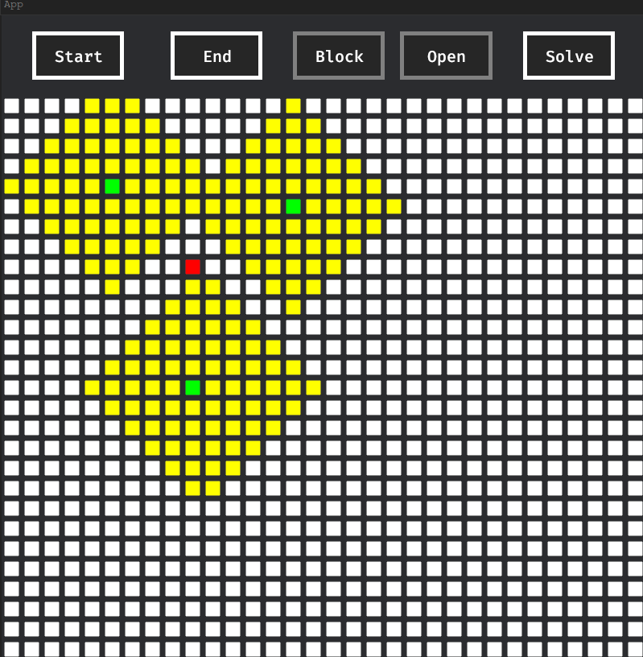

# Algorithm 

This should help to get a better understanding how some algorithms work by playing around with them
and look at their visualization

## Demo

You can have multiple starts if you want (Currently you can also have multiple endpoints but that is not intended)

## TODOS

### Fixes 

* fix: Buttons allignments
* fix: Better structure (the board state should be better)
* fix: Implement block detection
* fix: Button states should reset after another one is pressed
* fix: Only one endgoal should be placable

### Planned features

* feat: More algorithms (for pathfinding and in generell)
    * feat: Menu in the future to select different ones
